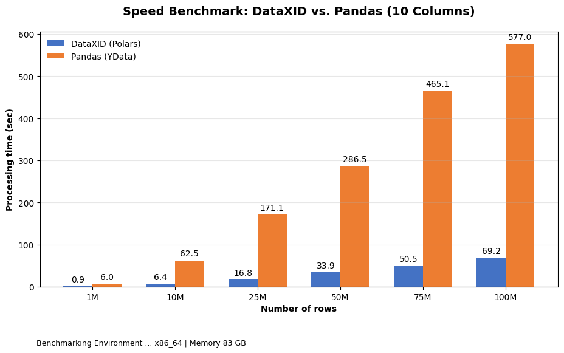
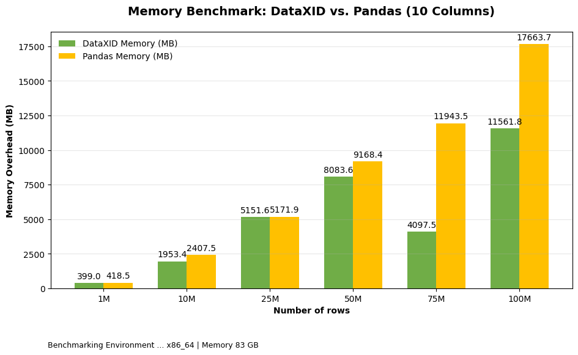
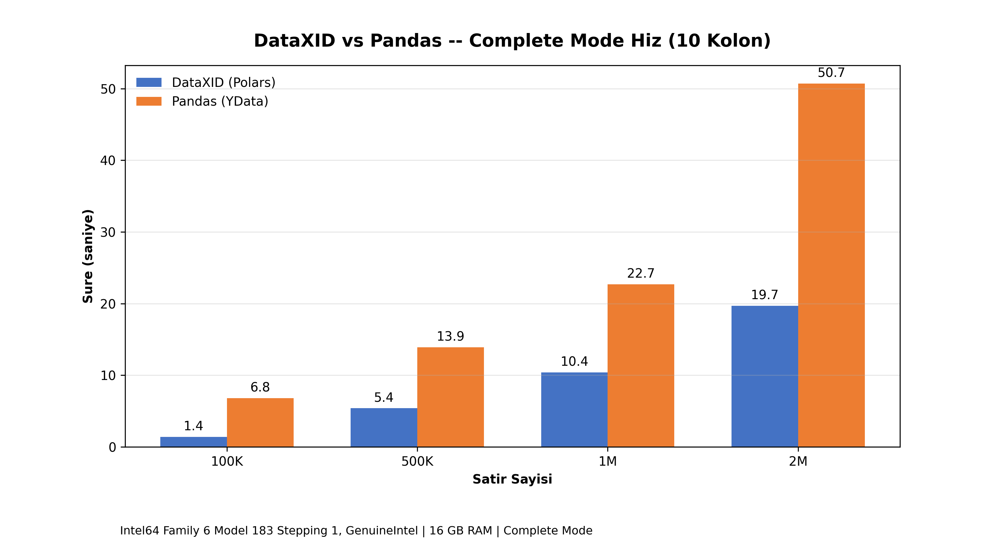
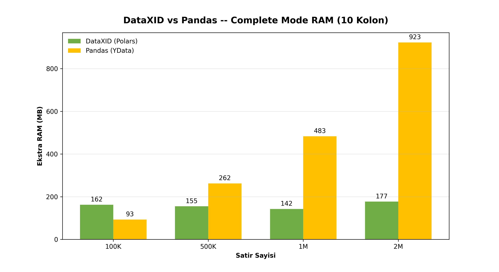
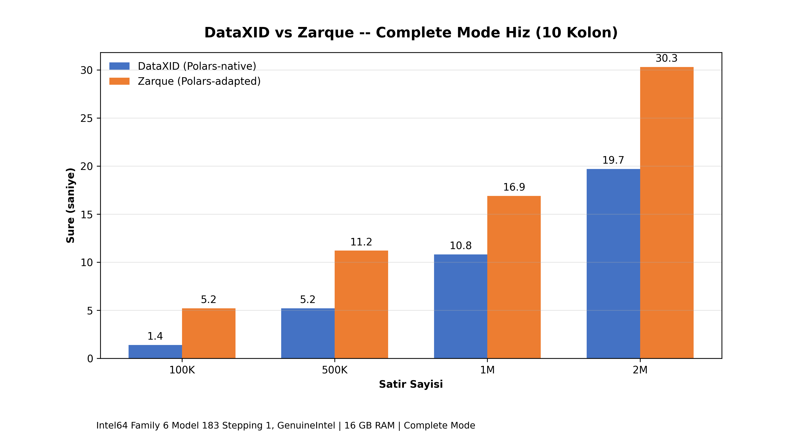
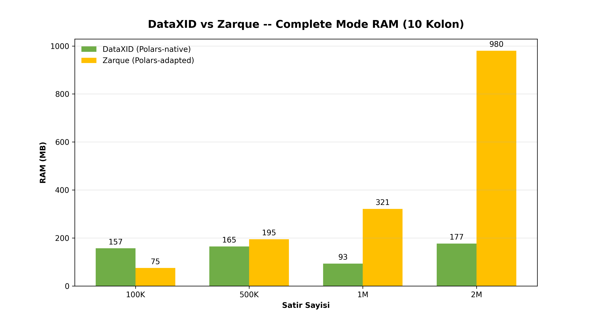

# DataXID vs Zarque vs YData — Profiling Benchmark

Bu proje, üç farklı veri profilleme kütüphanesinin hız ve RAM performansını karşılaştırmalı olarak test eder:

| Araç                  | Mimari                                                       | Python      |
|-----------------------|--------------------------------------------------------------|-------------|
| **DataXID Profiling** | Sıfırdan Polars-native, tek process                          | ≥3.10       |
| **Zarque Profiling**  | ydata-profiling fork'u, Polars'a uyarlanmış, multiprocessing | ≥3.7, <3.12 |
| **YData Profiling**   | Pandas tabanlı, tek process                                  | ≥3.8        |

## Proje Amacı

Üç kütüphanenin 1M → 100M satır arası sentetik veri üzerinde süre ve RAM performansını iki farklı modda (hafif/overview + complete/tam analiz) ölçmek. Özellikle Polars tabanlı araçların (DataXID, Zarque) Pandas'a karşı üstünlüğünü ve kendi aralarındaki scaling farklarını metriklerle ortaya koymak.

---

## Benchmark Sonuçları

### Minimal Mod — DataXID vs Zarque (Local)

> 10 kolon, `mode="overview"` / `minimal=True` | 13th Gen i7-13650HX, 16 GB RAM

| Satır | DataXID | Zarque | Hızlı Olan   |
|-------|---------|--------|--------------|
| 1M    | 0.4s    | 0.2s   | Zarque 2.1x  |
| 10M   | 4.2s    | 2.2s   | Zarque 1.9x  |
| 25M   | 23.6s   | 9.5s   | Zarque 2.5x  |
| 50M   | 36.3s   | 26.5s  | Zarque 1.4x  |
| 75M   | 66.9s   | 83.6s  | DataXID 1.2x |
| 100M  | 111.1s  | 121.1s | DataXID 1.1x |


### Minimal Mod — DataXID vs YData / Pandas (Colab)

> 10 kolon, `mode="overview"` / `minimal=True` | Colab Cloud CPU, 83 GB RAM

| Satır | DataXID | YData (Pandas) |
|-------|---------|----------------|
| 1M    | 0.9s    | 6.0s           |
| 10M   | 6.4s    | 62.5s          |
| 25M   | 16.8s   | 171.1s         |
| 50M   | 33.9s   | 286.5s         |
| 75M   | 50.5s   | 465.1s         |
| 100M  | 69.2s   | 577.0s         |




**Minimal mod bulguları:**
- Local'de 16 GB RAM ile Zarque ve DataXID 100M'yi sorunsuz tamamlıyor; Pandas 25M'de OOM veriyor
- Colab'de 83 GB RAM ile Pandas 100M'yi 577 saniyede tamamladı — DataXID'den **8.3x yavaş**
- Crossover 50M-75M arasında: Zarque küçük-orta veride hızlı, DataXID büyük veride öne geçiyor

---

### Complete Mod — DataXID vs Pandas (Local)

> 10 kolon, `mode="complete"` / `minimal=False` | 13th Gen i7-13650HX, 16 GB RAM

| Satır | DataXID       | Pandas (YData) | Fark                            |
|-------|---------------|----------------|---------------------------------|
| 100K  | 1.4s / 162MB  | 6.8s / 93MB    | DataXID 4.7x hızlı              |
| 500K  | 5.4s / 155MB  | 13.9s / 262MB  | DataXID 2.6x hızlı, 1.7x az RAM |
| 1M    | 10.4s / 143MB | 22.7s / 483MB  | DataXID 2.2x hızlı, 3.4x az RAM |
| 2M    | 19.7s / 177MB | 50.7s / 923MB  | DataXID 2.6x hızlı, 5.2x az RAM |




### Complete Mod — DataXID vs Zarque (Local)

> 10 kolon, `mode="complete"` / `minimal=False` | 13th Gen i7-13650HX, 16 GB RAM

| Satır | DataXID       | Zarque        | Fark                            |
|-------|---------------|---------------|---------------------------------|
| 100K  | 1.4s / 157MB  | 5.2s / 75MB   | DataXID 3.7x hızlı              |
| 500K  | 5.2s / 165MB  | 11.2s / 195MB | DataXID 2.2x hızlı              |
| 1M    | 10.8s / 93MB  | 16.9s / 321MB | DataXID 1.6x hızlı, 3.4x az RAM |
| 2M    | 19.7s / 177MB | 30.3s / 980MB | DataXID 1.5x hızlı, 5.5x az RAM |




**Complete mod bulguları:**
- Pandas RAM tüketimi veri büyüdükçe katlanıyor (100K: 93MB → 2M: 923MB), DataXID sabit kalıyor (~160MB)
- Zarque 2M'de RAM patlaması yaşıyor (980MB) — multiprocessing pickle serileştirme maliyeti
- Zarque minimal modda küçük veride hızlıyken, complete modda DataXID tüm ölçeklerde önde

---

## Mod Karşılaştırması: Overview vs Complete

| Özellik                | DataXID `overview` | DataXID `complete` | Zarque `minimal=True` | Zarque `minimal=False` |
|------------------------|--------------------|--------------------|-----------------------|------------------------|
| Tip Çıkarımı           | Otomatik           | Otomatik           | visions               | visions                |
| Korelasyonlar          | Atlanır            | Var                | Atlanır               | Var                    |
| Scatter + Boxplot      | Atlanır            | Var                | Atlanır               | Var                    |
| Karakter Frekansı      | Atlanır            | Var                | Kapalı                | Var                    |
| Alert Sistemi          | 8 tip (corr yok)   | 9 tip (tam)        | pandas-profiling      | pandas-profiling       |
| Yinelenen Satır Örneği | Atlanır            | Var                | Gösterilmez           | Gösterilir             |

---

## Kullanılan Veri Setleri

1. **Telco Customer Churn:** Kategorik ve sayısal veri tiplerinin bir arada olduğu gerçek dünya veri seti (7.043 satır, 21 kolon)
2. **NSL-KDD (Ağ Saldırı Tespiti):** Yüksek boyutlu, korelasyon ağırlıklı stres testi (~126K satır, 42 kolon)
3. **Sentetik Benchmark Verisi:** 10 kolon (5 sayısal + 3 kategorik + 2 boolean), 100K → 100M satır

---

## Klasör Yapısı

```
├── benchmarks/
│   ├── dataxid_vs_pandas/
│   │   ├── minimal/                     # Hafif mod benchmark
│   │   │   ├── run.py, data_generator.py, benchmark_runner.py, visualizer.py
│   │   ├── complete/                    # Tam mod benchmark (süre + RAM)
│   │   │   ├── run.py, data_generator.py, benchmark_runner.py, visualizer.py
│   │   └── dataxid_vs_pandas_benchmark.ipynb  # Colab notebook
│   ├── dataxid_vs_zarque/
│   │   ├── minimal/                     # Hafif mod benchmark
│   │   │   ├── run.py, data_generator.py, benchmark_runner.py, visualizer.py
│   │   ├── complete/                    # Tam mod benchmark (süre + RAM)
│   │   │   ├── run.py, data_generator.py, benchmark_runner.py, visualizer.py
│   │   │   └── gen_all.py               # HTML rapor üretici (3 araç)
│   │   └── html_compare/                # HTML karşılaştırma script'i
│   │       └── gen_all.py
│   └── real_data/                       # Gerçek veri seti testleri
│       ├── telco_benchmark.py
│       └── nsl_kdd_benchmark.py
├── benchmark_outputs/
│   ├── charts/
│   │   ├── minimal/                     # Hafif mod grafikleri
│   │   └── complete/                    # Tam mod grafikleri
│   └── html_reports/
│       ├── telco_complete/              # DataXID + Zarque + Pandas complete HTML
│       ├── telco_original/              # Orijinal vs sentetik raporları
│       └── nsl_kdd/                     # NSL-KDD raporları
├── datasets/                            # CSV veri setleri
├── dataxid-profiling/                   # DataXID kütüphanesi (git submodule)
└── dataxid-python/                      # DataXID SDK (git submodule)
```

---

## Kurulum

```bash
python -m venv .venv
.venv\Scripts\activate       # Windows
source .venv/bin/activate    # macOS/Linux

pip install -e ./dataxid-profiling
pip install zarque-profiling ydata-profiling matplotlib polars numpy psutil

# Zarque uyumluluğu için (pydantic v1 + matplotlib 3.8)
pip install "pydantic>=1.8.1,<2.0" "matplotlib==3.8.4" "scipy<1.13,>=1.4.1"
```

## Çalıştırma

```bash
# Hafif mod — DataXID vs Zarque
python benchmarks\dataxid_vs_zarque\minimal\run.py

# Hafif mod — DataXID vs Pandas (Colab notebook)
# benchmarks\dataxid_vs_pandas\dataxid_vs_pandas_benchmark.ipynb

# Complete mod — DataXID vs Zarque
python benchmarks\dataxid_vs_zarque\complete\run.py

# Complete mod — DataXID vs Pandas
python benchmarks\dataxid_vs_pandas\complete\run.py

# HTML rapor karşılaştırması (Telco, 3 araç complete)
python benchmarks\dataxid_vs_zarque\complete\gen_all.py

# Gerçek veri seti testleri
python benchmarks\real_data\telco_benchmark.py
python benchmarks\real_data\nsl_kdd_benchmark.py
```

---

## Teknik Analiz: DataXID Neden Hızlı?

| Özellik             | Pandas                     | Polars (DataXID)                                |
|---------------------|----------------------------|-------------------------------------------------|
| **Veri Modeli**     | Satır tabanlı (row-based)  | Sütun tabanlı (columnar, Apache Arrow)          |
| **Dil**             | Python + NumPy (C)         | Rust                                            |
| **Threading**       | GIL kısıtlı, single-thread | Native multi-threading                          |
| **Bellek**          | Her işlemde kopya          | Zero-copy (Arrow)                               |
| **Değerlendirme**   | Eager (hemen çalıştır)     | Lazy (ifade ağacı optimize et)                  |
| **Scipy Kullanımı** | —                          | Kendall tau-b: scipy O(n log n) vs Polars O(n²) |

### Zarque Neden Büyük Veride Yavaşlıyor?

Zarque, Pandas'tan Polars'a geçiş yapmış ancak `multiprocessing` mimarisini korumuştur. Küçük verilerde process'ler arası paralellik avantaj sağlarken, veri büyüdükçe process'ler arası **pickle serileştirme maliyeti** tüm kazancı yok eder. DataXID ise sıfırdan Polars-native yazıldığı için **zero-copy + single-process multi-threading** ile büyük veride de stabildir.
