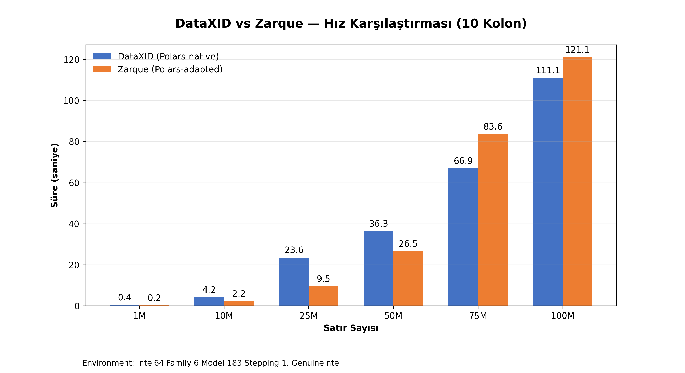

# DataXID vs Zarque vs YData — Profiling Benchmark

Bu proje, üç farklı veri profilleme kütüphanesinin hız performansını karşılaştırmalı olarak test eder:

| Araç                  | Mimari                                                       | Python      |
|-----------------------|--------------------------------------------------------------|-------------|
| **DataXID Profiling** | Sıfırdan Polars-native, tek process                          | ≥3.10       |
| **Zarque Profiling**  | ydata-profiling fork'u, Polars'a uyarlanmış, multiprocessing | ≥3.7, <3.12 |
| **YData Profiling**   | Pandas tabanlı, tek process                                  | ≥3.8        |

## Proje Amacı

Üç kütüphanenin 1M → 100M satır arası sentetik veri üzerinde süre performansını ölçmek. Özellikle Polars tabanlı araçların (DataXID, Zarque) Pandas'a karşı üstünlüğünü ve kendi aralarındaki scaling farklarını metriklerle ortaya koymak.

---

## Benchmark Sonuçları

> Tüm testler **10 kolon** (5 sayısal + 3 kategorik + 2 boolean), **hafif mod** ile yapılmıştır.

### Local — DataXID vs Zarque

```
CPU: 13th Gen Intel Core i7-13650HX | RAM: 16 GB
```

| Satır | DataXID | Zarque | Hızlı Olan   |
|-------|---------|--------|--------------|
| 1M    | 0.4s    | 0.2s   | Zarque 2.1x  |
| 10M   | 4.2s    | 2.2s   | Zarque 1.9x  |
| 25M   | 23.6s   | 9.5s   | Zarque 2.5x  |
| 50M   | 36.3s   | 26.5s  | Zarque 1.4x  |
| 75M   | 66.9s   | 83.6s  | DataXID 1.2x |
| 100M  | 111.1s  | 121.1s | DataXID 1.1x |



### Colab — DataXID vs YData (Pandas)

```
CPU: Colab Cloud CPU | RAM: 83 GB
```

| Satır | DataXID | YData (Pandas) |
|-------|---------|----------------|
| 1M    | 0.9s    | 6.0s           |
| 10M   | 6.4s    | 62.5s          |
| 25M   | 16.8s   | 171.1s         |
| 50M   | 33.9s   | 286.5s         |
| 75M   | 50.5s   | 465.1s         |
| 100M  | 69.2s   | 577.0s         |


**Bulgular:**
- **Local'de 16 GB RAM ile** Zarque ve DataXID 100M'yi sorunsuz tamamlıyor; Pandas 25M'de OOM veriyor
- **Colab'de 83 GB RAM ile** Pandas 100M'yi 577 saniyede tamamlayabildi — DataXID'den **8.3x yavaş**
- **Crossover 50M-75M arasında**: Zarque küçük-orta veride hızlı, DataXID büyük veride öne geçiyor
- Zarque'in multiprocessing avantajı 50M'de tükeniyor — büyük veride serialize maliyeti kazancı geçiyor

---

## Hafif Mod Config Karşılaştırması

Her üç araçta **hafif/overview mod** karşılaştırması:

| Özellik         | DataXID (`mode="overview"`)      | Zarque (`minimal=True`) | YData (`minimal=True`) |
|-----------------|----------------------------------|-------------------------|------------------------|
| Tip Çıkarımı    | Otomatik                         | visions kütüphanesi     | Kapalı                 |
| Korelasyonlar   | **Atlanır**                      | **Atlanır**             | **Atlanır**            |
| Etkileşimler    | **Atlanır**                      | **Atlanır**             | **Atlanır**            |
| Eksik Veri      | ECharts otomatik                 | Kapalı                  | Kapalı                 |
| Kategorik Metin | Uzunluk + kelime                 | Kapalı                  | Kapalı                 |
| Yinelenen Satır | **Atlanır**                      | Gösterilmez (head: 0)   | Gösterilmez (head: 0)  |
| Head/Tail       | 10 satır                         | 0 satır                 | 0 satır                |
| Alert Sistemi   | 9 alert tipi (tam)               | pandas-profiling alert  | pandas-profiling alert |

---

## Config ile Oynama

### DataXID (`ProfileConfig`)

```python
from dataxid_profiling import ProfileReport, ProfileConfig

# Hafif mod
config = ProfileConfig(mode="overview")

# Tam analiz — eşiklerle
config = ProfileConfig(
    mode="complete",
    missing_threshold=0.05,       # %5 üstü eksik → alert
    correlation_threshold=0.8,    # |corr| > 0.8 → alert
    skewness_threshold=2.0,       # |skew| > 2 → alert
    imbalance_threshold=0.9,      # top değer > %90 → alert
    interaction_sample_size=100_000,
    histogram_bins=50,
)

report = ProfileReport(df, config=config)
```

### Zarque

```python
from zarque_profiling import ProfileReport

# Hafif mod (varsayılan)
report = ProfileReport(df, minimal=True)

# Tam analiz
report = ProfileReport(df, minimal=False)
```

### YData (Pandas)

```python
from ydata_profiling import ProfileReport

# Hafif mod
report = ProfileReport(df, minimal=True)

# Tam analiz
report = ProfileReport(df, title="Tam Rapor")
```

---

## Kullanılan Veri Setleri

1. **Telco Customer Churn:** Kategorik ve sayısal veri tiplerinin bir arada olduğu gerçek dünya veri seti
2. **NSL-KDD (Ağ Saldırı Tespiti):** Yüksek boyutlu, korelasyon ağırlıklı stres testi
3. **Sentetik Benchmark Verisi:** 10 kolon (5 sayısal + 3 kategorik + 2 boolean), 1M → 100M satır

---

## Test Edilen Metrikler

- **Süre (`time.perf_counter`):** Raporlama hızı
- **Scaling:** Satır sayısı arttıkça sürenin nasıl değiştiği
- **OOM Dayanıklılığı:** Hangi araç hangi satır sayısında çöküyor

---

## Klasör Yapısı

```
├── benchmarks/
│   ├── dataxid_vs_pandas_benchmark.ipynb     # DataXID vs YData (Jupyter/Colab)
│   ├── dataxid_vs_zarque_benchmark/          # DataXID vs Zarque (local .py)
│   │   ├── run.py                            # Ana çalıştırma
│   │   ├── data_generator.py                 # Sentetik veri üretici
│   │   ├── benchmark_runner.py               # Süre ölçüm modülü
│   │   └── visualizer.py                     # Grafik çizici
│   ├── telco_benchmark.py                    # Telco Churn testi
│   └── nsl_kdd_benchmark.py                  # NSL-KDD testi
├── benchmark_outputs/
│   ├── benchmark_speed.png                   # Son benchmark grafiği
│   ├── telco_churn/                          # Telco HTML raporları
│   └── nsl_kdd/                              # NSL-KDD HTML raporları
├── datasets/                                 # CSV veri setleri
├── dataxid-profiling/                        # DataXID kütüphanesi (git submodule)
├── dataxid-python/                           # DataXID SDK (git submodule)
└── reports/                                  # Nihai özet metinleri
```

## Kurulum

```bash
python -m venv .venv
.venv\Scripts\activate       # Windows
source .venv/bin/activate    # macOS/Linux

pip install -e ./dataxid-profiling
pip install zarque-profiling ydata-profiling matplotlib polars numpy

# Zarque patch'leri (Polars 1.40+ ve pydantic uyumluluğu için)
pip install "pydantic>=1.8.1,<2.0"
```

## Çalıştırma

```bash
# Local benchmark
python benchmarks\dataxid_vs_zarque_benchmark\run.py

# Jupyter/Colab
jupyter notebook benchmarks\dataxid_vs_pandas_benchmark.ipynb
```
